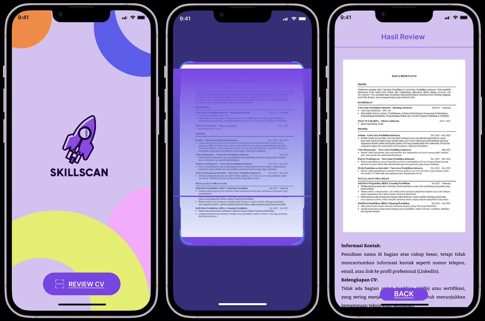

# SkillScan – AI-Powered Resume Analyzer  

SkillScan is a mobile application built with **Flutter** and integrated with **Gemini AI** to help users analyze their resumes. The app provides insights into the **strengths** and **areas of improvement** of a selected resume, making it easier for users to enhance their CV before job applications.

<p align="center">
  
</p>

---

## ✨ Features  

- **Resume Upload & Selection** – Users can choose and upload their resume directly from the app.  
- **AI-Powered Analysis** – Integrated with **Gemini AI** to provide detailed feedback on strengths and weaknesses of the resume.  
- **Actionable Suggestions** – Receive personalized recommendations to improve the resume quality.  

---

## 🛠 Tech Stack  

- **Flutter** – Cross-platform app development.  
- **Gemini AI** – AI integration for resume analysis.  

---

## 🚀 Getting Started  

1. **Clone the repository**  
   ```bash
   git clone https://github.com/your-username/skillscan.git
   cd skillscan
   ```
2. **Install dependencies**
   ```bash
    flutter pub get
   ```
3. Configure API keys for Gemini AI and backend services in .env or config file.
4. Run the app
   ```bash
    flutter run
   ```
